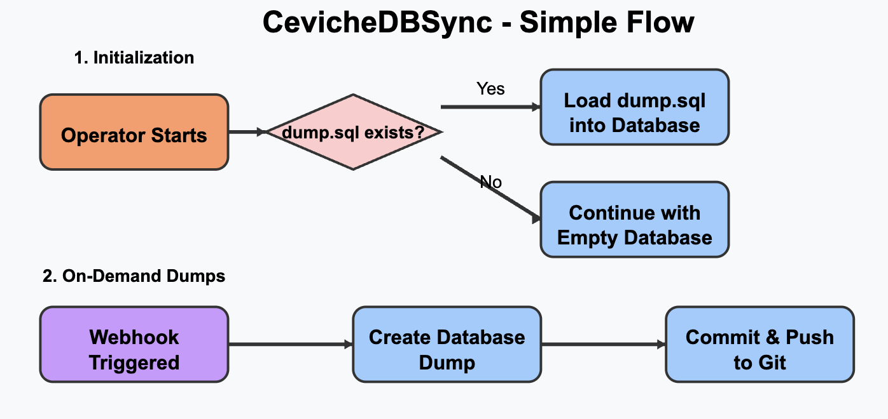

# Ceviche DB Sync Operator
A Kubernetes operator to automate PostgreSQL database dumps and sync with Git repositories.


## Description
The Ceviche Database Sync Operator watches PostgreSQL StatefulSets in Kubernetes and automatically creates, manages, and synchronizes database dumps to Git repositories. This enables easy backup, versioning, and recovery of database content.

### Low effort diagram made with Claude




### To Install CRDs

```sh
kubectl apply -f https://raw.githubusercontent.com/jcroyoaun/cevichedbsync/master/config/crd/bases/ceviche.jcroyoaun.io_postgressyncs.yaml
```


### Usage
1. Create a secret with Git credentials
```yaml
apiVersion: v1
kind: Secret
metadata:
  name: git-credentials
  namespace: postgres
type: Opaque
data:
  username: <base64-encoded-git-username>
  password: <base64-encoded-git-token>
```

2. Create a Secret with database credentials:
```yaml
apiVersion: v1
kind: Secret
metadata:
  name: postgres-credentials
  namespace: postgres
type: Opaque
data:
  username: <base64-encoded-db-username>
  password: <base64-encoded-db-password>
  database: <base64-encoded-db-name>
  port: <base64-encoded-port>
```

3. Create a PostgresSync resource:
```yaml
apiVersion: ceviche.jcroyoaun.io/v1alpha1
kind: PostgresSync
metadata:
  name: sample-postgres-sync
  namespace: postgres
spec:
  repositoryURL: "https://github.com/yourusername/your-repo.git"
  databaseDumpPath: "dumps"
  gitCredentials:
    secretName: git-credentials
  databaseCredentials:
    secretName: postgres-credentials
  databaseService:
    name: postgres-svc
    namespace: postgres
  statefulSetRef:
    name: postgres
  dumpOnWebhook: false
```

4. Hit the Webhook endpoint to trigger a dump
```yaml
curl -X POST http://<operator-service>:8082/dump/postgres/sample-postgres-sync

```

NOTE: In need of port-forwarding pod directly to hit endpoint, ie:
```bash
kubectl port-forward cevichedbsync-operator-controller-manager-6d96687855-hjgjw 8082:8082 -n cevichedbsync
```

## Contributing
Send me a DM on x.com/@jcroyoaun

**NOTE:** Run `make help` for more information on all potential `make` targets

More information can be found via the [Kubebuilder Documentation](https://book.kubebuilder.io/introduction.html)

## License

Copyright 2025.

Licensed under the Apache License, Version 2.0 (the "License");
you may not use this file except in compliance with the License.
You may obtain a copy of the License at

    http://www.apache.org/licenses/LICENSE-2.0

Unless required by applicable law or agreed to in writing, software
distributed under the License is distributed on an "AS IS" BASIS,
WITHOUT WARRANTIES OR CONDITIONS OF ANY KIND, either express or implied.
See the License for the specific language governing permissions and
limitations under the License.

